# Certificate Processing

<!-- @import "[TOC]" {cmd="toc" depthFrom=2 depthTo=3 orderedList=true} -->

<!-- code_chunk_output -->

- [Certificate Processing](#certificate-processing)
  - [Outbound Process](#outbound-process)
    - [Preview](#preview)
  - [Inbound process](#inbound-process)

<!-- /code_chunk_output -->

## Outbound Process

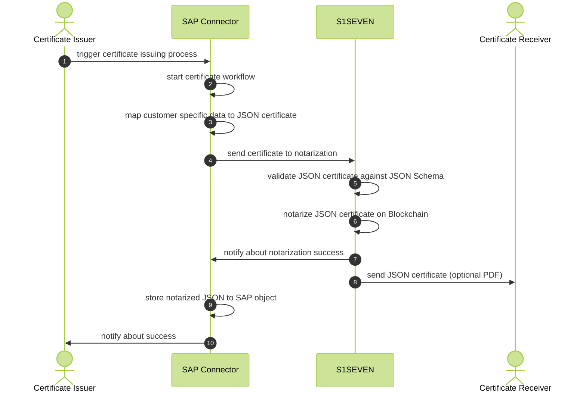

Following, the process of notarizing a certificate proving the quality of produced materials in the mill industry is described. S1SEVEN DMP is used to provide the data in the correct format for the S1SEVEN stack to notarize it via blockchain. This notarization process can be carried out for various data objects. Here, a specific message type (certificate) is linked to an outbound delivery. Please note that this is just one example of using S1SEVEN DMP. All the different objects in an SAP system can be used to act as a basis for the certificate.

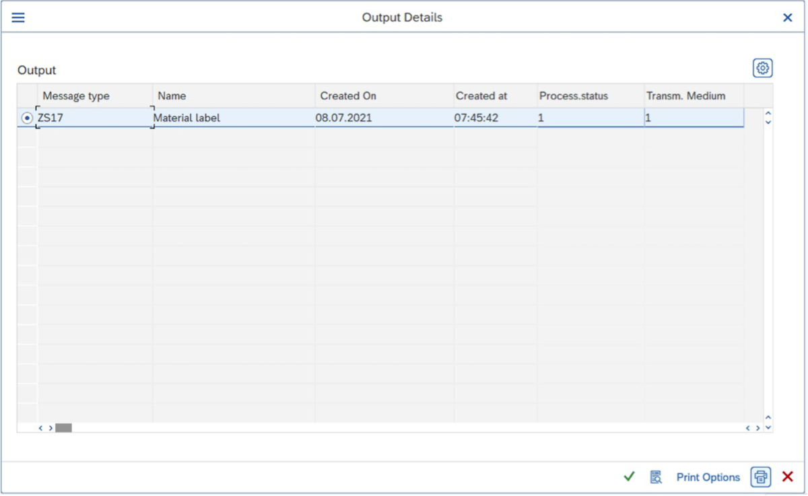

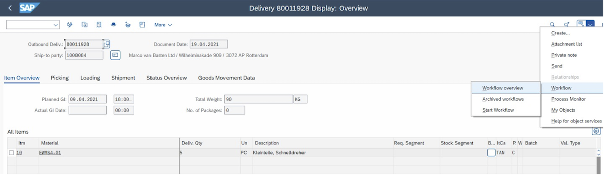

By starting the printing process (button "Print") the workflow of UBC.flow is triggered. In this case, the workflow for the selected item starts and can be visualized in GOS (Generic Object Service), where all processed steps are recorded. For each step, status, result as well as creation and end date/time are listed.
First, the "Mapping" process is carried out which is responsible for translating the data object information into JSON schema format. This data mapping can be sourced individually from SAP standard, variant configurator, or any kind of Master Data Management tool.
The JSON schema as described at [Material Identity](https://materialidentity.org) defines the target format data to be mapped into. ABAP types will be generated for every JSON schema which is used to provide a very well-known environment for every ABAP developer.
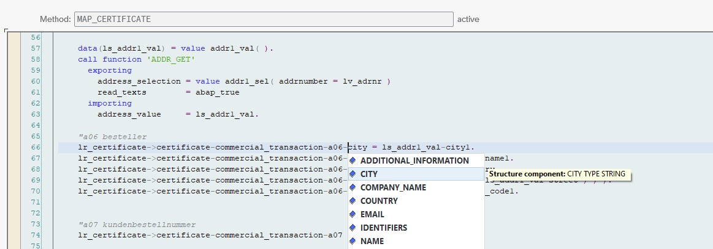

In the "Posting" step, the S1SEVEN stack is addressed, checking whether the available data has already been notarized. If not, S1SEVEN DMP waits to receive notarization information from the S1SEVEN stack.

The notarization confirmation of a certificate can be triggered by:

- MQTT event for topic `notarize_one`, which is the recommendation as it enables realtime processing. No middleware will be needed and is running/integrating with S1SEVEN out of the box.
- by manually calling endpoint `/ubc/s1seven/certificate/notarize`, for test purposes in Swagger UI (transaction `/UBC/SWAGGER`) and/or if MQTT is not an option (e.g., forced to use middleware)

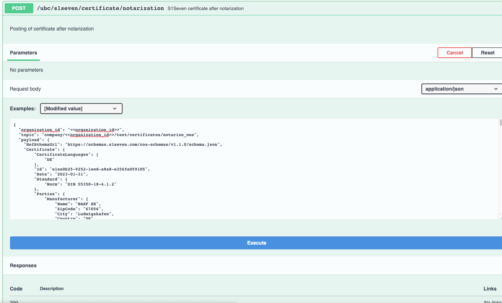

Within seconds, the notarization is processed, and all steps are recorded:
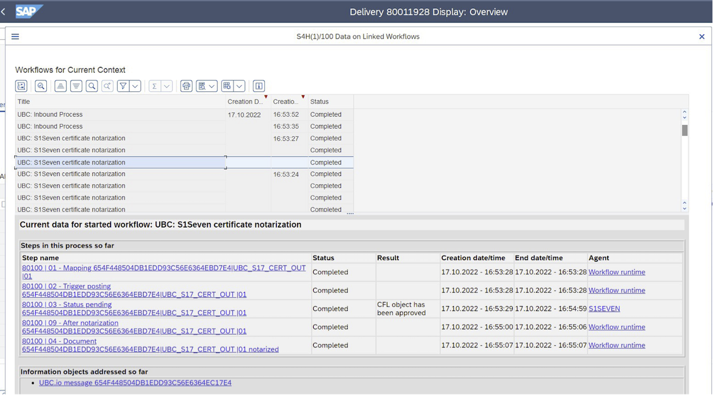

In the screen above, the notarization as well as other process steps indicate the status `Completed`. The completed status indicates the successful execution of events based on the notarization.

In the next screen the PDF generated from the JSON is attached to an outbound delivery as a post-processing event. Please note that this step is optional and customer-specific. PDF data can be requested at any time, as S1SEVEN DMP stores the notarized JSON data. This post processing step can be activated quite easily.
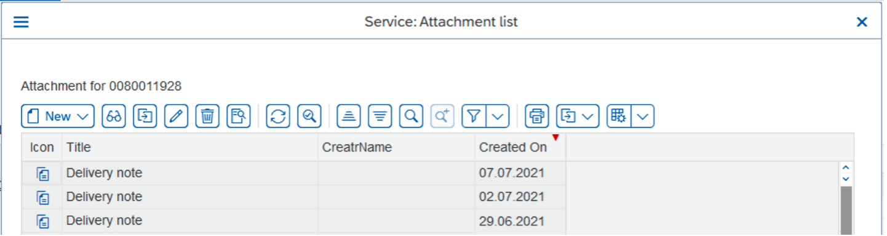

The whole notarization process is highly customizable by a customer and can be adapted to its needs.

### Preview

In addition to the regular certficate output, there is the option to preview the printing of certificate as a PDF prior to the notarization. By pressing the `Print preview` button all data for the certificate are gathered, transformed into JSON format and sent to S1SEVEN stack for PDF rendering. The visualized preview "Demo certificate" contains the same information as the notarized document on the blockchain.

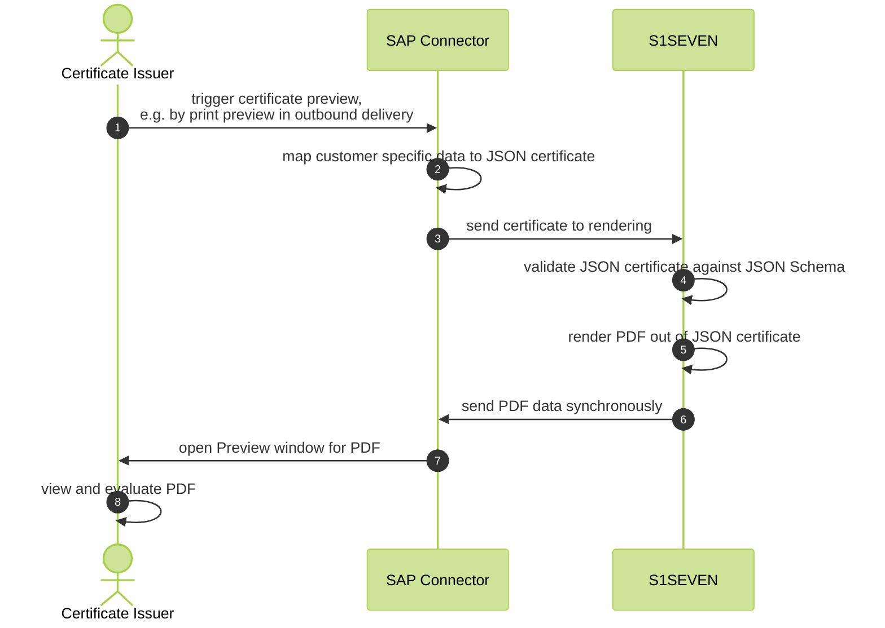

Example PDF document:
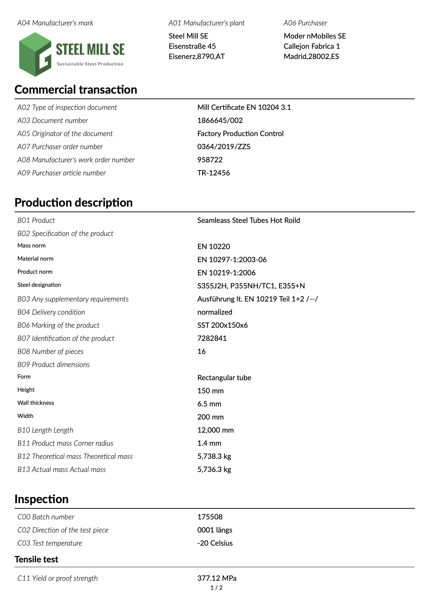

## Inbound process

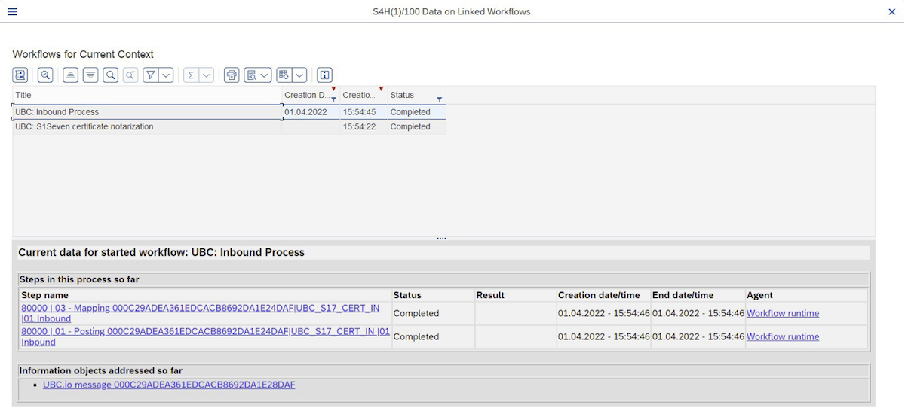

The inbound processing of a certificate can be triggered by:

- MQTT event for topic `receive_one`, which is the recommendation as it enables realtime processing. No middleware will be needed and is running/integrating with S1SEVEN out of the box.
- by manually calling endpoint `/ubc/s1seven/certificate/inbound`, for test purposes in Swagger UI (transaction `/UBC/SWAGGER`) and/or if MQTT is not an option (e.g., forced to use middleware)
  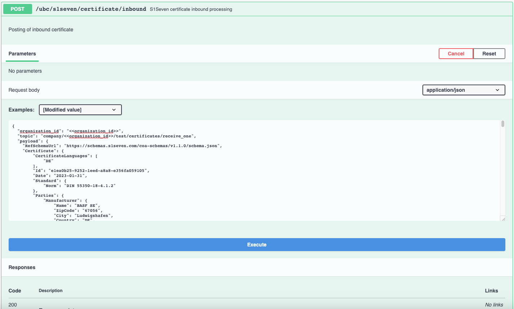

The certificate implementation will be derived from the given schema within payload. Dedicated process methods are called and can be implemented customer-specific.