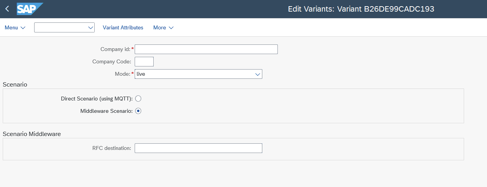

# Table of Content

<!-- @import "[TOC]" {cmd="toc" depthFrom=2 depthTo=3 orderedList=true} -->

<!-- code_chunk_output -->

- [Table of Content](#table-of-content)
  - [SAP System Setup](#sap-system-setup)
    - [System Setup with /UBC/S17\_SETUP](#system-setup-with-ubcs17_setup)
    - [Proxy Setup with /UBC/S17\_SETUP\_PROXY](#proxy-setup-with-ubcs17_setup_proxy)
  - [Certificate Configuration/Implementation instructions](#certificate-configurationimplementation-instructions)
    - [Outbound case - issuing/notarizing Certificates](#outbound-case---issuingnotarizing-certificates)
      - [Print program/freestyle integration](#print-programfreestyle-integration)
      - [IDOC integration](#idoc-integration)
    - [Inbound case - receiving Certificates](#inbound-case---receiving-certificates)
  - [Connectivity](#connectivity)
    - [Direct communication with S1SEVEN](#direct-communication-with-s1seven)
      - [SAP to S1SEVEN API for outbound messages](#sap-to-s1seven-api-for-outbound-messages)
      - [S1SEVEN to SAP for inbound messages](#s1seven-to-sap-for-inbound-messages)
        - [Messages via REST webservice calls](#messages-via-rest-webservice-calls)
        - [Messages via MQTT over Websocket](#messages-via-mqtt-over-websocket)
    - [Indirect Communication with S1SEVEN via Middleware](#indirect-communication-with-s1seven-via-middleware)
      - [SAP Integration Suite/Cloud Platform Integration (CPI)](#sap-integration-suitecloud-platform-integration-cpi)
        - [Integration Package/iFlow](#integration-packageiflow)
        - [Open Connector](#open-connector)
          - [SAP to S1SEVEN API for outbound messages](#sap-to-s1seven-api-for-outbound-messages-1)
          - [S1SEVEN to SAP for inbound messages](#s1seven-to-sap-for-inbound-messages-1)
  - [Monitoring](#monitoring)
  - [Authorization](#authorization)
  - [Data Archiving](#data-archiving)
  - [Compatibility](#compatibility)

<!-- /code_chunk_output -->

## SAP System Setup

After the successful installation of S1SEVEN DMP, transaction `/UBC/SETUP_BASIC` is to be called.

The task list `/UBC/S17_SETUP` then guides through the steps required for setting up Unified Backend Connector at your system and enabling S1SEVEN use cases _technically_. Executing this task list is required for each client in the system to set up S1SEVEN DMP.
There is another task list for setting up all the S1SEVEN proxy related configuration called `/UBC/S17_SETUP_PROXY`. Basically, `/UBC/S17_SETUP` is for system setup configuration and needs to be executed once in a system/client. `/UBC/S17_SETUP_PROXY` is to be executed when a S1SEVEN stack needs to be connected. Usually the second one is also executed once in a client, but depends on wether multiple companies are connected to one client.
The steps are documented in the system itself. The documentation can be opened by pressing the button in column "Help". Some steps are automatic, which means the system executes the step itself without any user interaction needed. Other steps are manual and require confirmation. These steps are indicated by the `Person` symbol in column `Status`.

To start configuring UBC using the task list, click on `Execute`. As soon as a step with manual activities is active, click on the button in column "Status" and confirm the manual activity described in the documentation.
Some steps are GUI-tasks which are semi-automatic steps that require input data at a previous stage.
The execution is to be performed in dialog, and not in background mode.

### System Setup with /UBC/S17_SETUP

See step documentation below for the details.

1. Activate BC-Set /UBC/S17 - **automatic task**
   BC-Set /UBC/S17 will be activated. During the activation, you will be prompted for a workbench and customizing request.
1. bgRFC configuration for REST channel - **automatic task with input**
   Creates bgRFC inbound destination and scheduler /UBC/S17_REST_CHANNEL. Limited to 1 workprocess. All notarization events are using this destination to decouple workflow and actual posting of data.
1. MQTT daemon setup (only for Direct Scenario, not by using Middlewar) - **automatic task with input**
   Using an S/4 system, a daemon can be scheduled to receive MQTT events.
   Default for S/4 systems. Make sure to specify RFC destination for user executing daemon (role /UBC/SERVICE recommended). The given server group has to make sure that only one application server is assigned. Daemon must only run once per client!
   See the step documentation for details.
1. Schedule MQTT Job (only for Direct Scenario, not by using Middleware) - **automatic task with input**
   Using an ECC system, daemons cannot be used. Instead, make use of periodically scheduled jobs using this task list.
   Default for ECC systems.
1. Check if needed system configuration was done - **automatic task with input**
   Choose the scenario in the parameters. Middleware or Direct?
   1. Direct Scenario (calling S1SEVEN API directly, MQTT/Webhook for inbound)
      1. The profile parameter `icm/HTTPS/client_sni_enabled` needs to be set
      2. MQTT was setup correctly (either by Job or by Daemon), see previous steps
   2. Middleware Scenario (e.g., Integration Suite)
      No specific check needed, please check your Middelware settings.

### Proxy Setup with /UBC/S17_SETUP_PROXY

You can use this task list for newly setting up a connection to S1SEVEN or if any of the details needs to be changed. (create/update)

Please sign up at [S1SEVEN Platform](https://app.s1seven.com) and

1. [Setup an issuer](https://manual.s1seven.com/certificate-issuers/)
1. [Setup applications and access tokens](https://manual.s1seven.com/automation/#applications-and-access-tokens)
   Currently we recommend to tick all scopes for `certificates` and to tick `identities:read_many` and `identities:read_one`.

Proceed with transaction /UBC/S17_SETUP_PROXY:

1. Configure S1SEVEN proxy - **automatic task with input**
   
   (depends on Scenario - Direct or Middleware)
   1. Company ID
      On S1SEVEN Platform, navigate to "Automate"->"Constants" and copy "Company ID":
      
   2. Mode
      Choose processing mode `live` or `test`
      [TODO](@stiebitzhofer) please add details or ref to document describing mode?
   3. Chosse from one of the following Scenarios. Wether to connect directly or connect via Middleware (as e.g., SAP Integration Suite)
      1. Scenario Direct
         
         Means that SAP is connecting directly to S1SEVEN API. MQTT is used for receiving "inbound" messages (see above [Connectivity](#connectivity)).
         1. Domain (mandatory)
            Enter [app.s1seven.com](app.s1seven.com). If you connect from the SAP test system is the productive environment and also the best option for all kind of testing SAP processes. Consider using mode `test` in test SAP environment.
         2. vHost (mandatory)
            Needed to connect with MQTT, please ask for the vHost by sending email to support@s1seven.com.
         3. ClientId and ClientSecret (mandatory)
            Please review instructions in the [S1SEVEN User Manual](https://manual.s1seven.com/automation/#applications-and-access-tokens).
            Copy "Client ID" and "Client Secret" from your previously created Application.
            
         4. Add optional proxy/gateway settings, if needed. Please consult the SAP Basis Team.
      2. Scenario Middleware
         
         Means that SAP is connecting not directly to S1SEVEN, but with Middleware instead (which is then forwarding the request synchronously to S1SEVEN). Webhook is used for receiving "inbound" messages (see above [Connectivity](#connectivity)).
         1. RFC destination (mandatory)
            Pointing to "base" URL resolving to <a>app.s1seven.\*</a> (e.g. app.s1seven.com).
            Please note, that for every request the specific endpoint is added to the base URL specified by RFC destination. (e.g. /api/health is added for health check).
            Example:
            
2. Store identity in configuration - **automatic task**
   Currently the last identity is used and stored in UBC configuration table `/UBC/PROXY`. If the identity changes, this step needs to be executed again.
   [TODO](@stiebitzhofer) please add some more details/correct?
3. Daemon restart after configuration changes, only for "Direct Scenario" - **manual task**
   1. If there is a running daemon it needs to be restarted after the configuration were changed.
   2. To do so, go to transaction SMDAEMON.
   3. See step documentation for further details.
4. Check health - automatic task
   1. Health check service is called to verify if setup was done successfully.
   2. After executing all these steps, the setup is completed. The system is basically ready for usage with S1SEVEN scenario.

## Certificate Configuration/Implementation instructions

S1SEVEN DMP allows to configure more than one type of certificate in the system:

1. Go to transaction `/UBC/CUSTOMIZING`, **Business object**.
   Create a new entry, e.g.:
   
   Note that the object type does not need to follow any naming convention and can be freely defined.
1. Enter category **2** which defines that this object is used as a `certificate`.
1. Enter `object type` and `path to id` (in dot notation in context of the chosen payload) which defines the link to an SAP standard object. This is optional, but required to make the workflow visible in GOS workflows for the specific object.
   For example, the delivery number is named `belnr` and given as a `input` the path would be `input.belnr`. All certificates triggered for those delivery will be show in it's GOS-UI.
1. Enter the implementation class for the certificate, which handles actions like `after notarization` or the mapping itself.
   - Inherit the class from appropriate super class, which depends on whether it is an outbound case: `/UBC/CL_S17_BO_CERT_OUT_ABS`, or an inbound case: `/UBC/CL_S17_BO_CERT_IN_ABS`. Please note that for outbound it further will be refined wether to use IDOC or a freestyle trigger, see below.
   - Generate ABAP types for the JSON schema which will be used. This enables the usage of the JSON schema in a very well known way for any ABAP developer: Generating dedicated static types. To do so, call transaction `/UBC/SCHEMA_STRUCT_G`:
     
     You have two options for supplying the schema definitions defined in `Schema Id`:
     - Choose "Http call", if the schema definitions URLs are reachable from your SAP system. In this case, SAP just downloads the definitions and alle the used references. No further input needed.
     - Choose "File upload", if the schema definitions URLs are not reachable froom your SAP system. In this case, you will be prompted for every schema definition which is used. Just open the link to the schema you are prompted it in your browser, copy and paste the content and confirm the popup.
       The output of this report will be a list of types statements, which then just have to be pasted into the previously created class and/or a global interface. Make sure to use the "top" type in your implementation, in this example `s_schema`.
1. Navigate to `attributes`
   1. Define schema which will be used to determine certificate implementation. This needs to be unique across all configured objects.
      Figure 15: Schema definition for certificate example
      
   2. (optional step), redefine Mode on object level
      The mode used for Notarization of Certificates is defined at proxy level. It can be redefined with creating an attribute `MODE`. Possible values are `live` and `test`.

### Outbound case - issuing/notarizing Certificates

1. Create a new class and choose the matching super class, see in below sections.
1. Specify a type for the JSON schema generated earlier (with the help of `/UBC/SCHEMA_STRUCT_G`) in method `create_type_certificate`
1. Construct a new Mapper implementation in method `create_mapper_certificate`, which inherits from the matching super class, see below. It is intended to map all the fields based on your input (IDOC/print program/freestyle) to a certificate structure.
1. The method `process_notarized_certificate` is called after the successful notarization. It is intended to be used for follow-up actions like "storing PDF at SAP object level".

> JSON data is transmitted besides the PDF document by default. This behavior can be changed and controlled for a specific customer, see example implementations mentioned below and method `/ubc/if_s17_bo~should_omit_json( )`.

#### Print program/freestyle integration

In the standard delivery, we offer an integration for a print program on an outbound delivery item.
When issuing the message, the notarization of a certificate will be started. Preview is also supported, in this case the mapping gets executed and the rendered PDF will be shown directly without notarizing a certificate.
For other use cases than for outbound delivery item, you can use the program `/UBC/S17_PRINT_DELIVERY_ITEM` as a template. Get in touch with us!
Setting up the print program integration for outbound delivery needs the following steps:

- Go to transaction `NACE` -> "Output Types" and customize a new output type (or reuse an existing one)
  Here is an example:
  
  Use the program `/UBC/S17_PRINT_DELIVERY_ITEM` and form routine `START_FUNCTION`
- (**optionally**) define Condition records in `NACE` - customer dependent, as by SAP standard
- Go to your business object in transaction `/UBC/CUSTOMIZING` -> "Business object configuration" and then to "Attributes" in the view cluster
- Create new entries for `KAPPL` and `KSCHL`, specifying your previous "Output type" customizing

  > Your business object is now linked to your output type

- Make sure your Business object implementation (on level "Business object" in view cluster) inherits from `/UBC/CL_S17_BO_CERT_OUT_PR_DI`.
- Return an object inheriting from `/UBC/CL_S17_BO_CERT_OUT_PRM_DI` in `create_mapper_certificate`
  In the method `map_dlvry_item_to_certificate` do all the necessary mapping from the given `QCERT` structure to the S1SEVEN schema

> See template classes `/UBC/CL_S17_BO_CERT_OUT_EX` and `/UBC/CL_S17_BO_CERT_OUT_MAP_EX` for example implementations.

#### IDOC integration

For outbound use cases, an IDOC integration is also offered. The implementation details can be found in the package `/UBC/S1SEVEN_EXAMPLE`. The classes `/UBC/CL_S17_BO_CERT_OUT_IDOCEX` and `/UBC/CL_S17_BO_CERT_OUT_IDMPEX` are relevant, whereas `/UBC/CL_S17_BO_CERT_OUT_IDOCEX` is the starting point.
The super class for your outbound BO class should be just `/UBC/CL_S17_BO_CERT_OUT_IDOC_A`. The `input` is dynamic and typed with the one specified in `create_type_idoc`.
The mapping class itself inherits from `/UBC/CL_S17_BO_CERT_OUT_MAP_EX`.
The example shows an integration for an `DELVRY03` IDOC output.
The following steps are needed:

1. call transaction `WE20` (Partner profiles) and do the necessary ALE/message control configuration. As in SAP standard, it is completely up to you wether to configure for a single customer or a "logical system". In this example, "logical system" is used. The IDOC is sent to UBC by setting "Receiver port" = `/UBC/IDOC`.
   
   Summary: Leave all the ALE settings "as is", just swap to "Receiver port" `/UBC/IDOC`.
2. Set IDOC Basic type (+ optional extension) for your business object in transaction `/UBC/CUSTOMIZING` -> "Business object configuration". Here: `DELVRY03`
3. Add IDOC message type to list of message type in the same view cluster for your object in "IDOC message types". Here: `DESADV`
4. Generate type for your IDOC (basic type + extension) by using transaction `/UBC/IDOC_STRUCT_GEN` and construct the type in your BO implementation method for `create_type_idoc`
5. Do all the necessary mapping from the IDOC into the JSON schema, see also example mapping class `/UBC/CL_S17_BO_CERT_OUT_IDMPEX`.

> Previewing and testing for IDOCs also is supported

Based on an IDOC the PDF can also be previewed by executing transaction `/UBC/S17_IDOC_PREVW`.
Specify values for the IDOC number you want to preview/test and the target S1SEVEN Company Id.

### Inbound case - receiving Certificates

For implementation details, please see package `/UBC/S1SEVEN_EXAMPLE`. The class `/UBC/CL_S17_BO_CERT_IN_EX` is relevant.

1. The method `create_type_certificate` creates the concrete type for the JSON schema generated earlier.
1. The method `process_inbound_certificate` processes the data. Any validation/processing is possible.

## Connectivity

Bi-directional connectivity between S1SEVEN and S1SEVEN SAP Addon needs to be ensured (basically SAP and [https://app.s1seven.\*/api/](https://app.s1seven.*/api/)).

For staging S1SEVEN environment [https://app.s1seven.dev](https://app.s1seven.dev)
For productive S1SEVEN environment [https://app.s1seven.com](https://app.s1seven.dev)

The following S1SEVEN API endpoints are utilized in the exchange between S1SEVEN and SAP Connector:

1. `POST /api/certificates/notarize` Notarize a document by calculating its hash and storing it on Blockchain.
1. `POST /api/certificates/render` Render the document as PDF or HTML document and return it in the response.
1. `POST /api/certificates/verify` Verify the integritity and authenticity of a document by calculating the hash and querying the Blockchain.
1. `POST /api/tokens/oauth2` Request new M2M authentication token.
1. `POST /api/identities` Request new identity.
1. `GET /api/identites` Retrieve the list of created identities for signing Blockchain transactions.
1. `GET /api/health` Check the availability of the S1SEVEN platform.

The full S1SEVEN OpenAPI documentation is available at [developers.s1seven.com](https://developers.s1seven.com/docs/openapi/)

There are multiple options to setup bi-directional communication, wnich a have to be evaluated by the customer within its systems constraints and organizational policies. Before going into the details, S1SEVEN recommends to use MQTT if possible.

### Direct communication with S1SEVEN

Direct communications means that the SAP Add.On and therefore SAP interacts directly with the S1SEVEN API, possibly using a gateway/proxy as best practice.

#### SAP to S1SEVEN API for outbound messages

APIs available at [app.s1seven.\*](app.s1seven.*) can be directly called from the SAP system itself. The following configurations must be applied:

- Set system parameter `icm/HTTPS/client_sni_enabled` (see also note [2124480- ICM / Web Dispatcher: TLS Extension Server Name Indication (SNI) as client](https://me.sap.com/notes/0002124480)). This system parameter is enabled in S/4 systems by default. It is required to manually set this parameter for ECC Systems.
- Import the SSL certificate of [app.s1seven.\*](app.s1seven.*) to your system (STRUST, Anonymous PSE).

#### S1SEVEN to SAP for inbound messages

SAP can receive inbound messages from S1SEVEN in two ways:

##### Messages via REST webservice calls

S1SEVEN offers the possibility to configure web hooks to which it will send data based on events like notarization or reception of certificates among others.
To enable that SAP endpoints, direct or indirect by proxy, have to be exposed to the internet at least for requests coming from [app.s1seven.\*](app.s1seven.*). This is technically possible but has two major drawbacks:

- SAP gets exposed to the internet contradicting usually all security guidelines.
- Messages might get lost due the fact that SAP is usually not 24/7 up in the same fashion as a cloud service.

##### Messages via MQTT over Websocket

S1SEVEN SAP DMP is able to act as a MQTT client over web socket to receive event notifications including the notarization and reception of certificates. The two most important advantages of using MQTT over REST webservices are:

- No ports on the firewall have to be opened for inbound request; by that no SAP endpoint is exposed.
- Garantueed delivery as messages are removed from queues at S1SEVEN only after SAP acknowleged the reception.

To setup MQTT there are two options available:

- Running the MQTT client as periodically scheduled job:
  The client (SAP system) connects to the broker, waits for messages for a predetermined number of seconds and disconnects afterwards. The job will be scheduled by initial configuration task list.
  Please note that this is the only technically possible option for < S/4 HANA 1809 systems, as daemons are not available.
- Running MQTT client as ABAP Daemon:
  An MQTT daemon runs once per client, connects to the MQTT broker and keeps the web socket connection alive.

Once a MQTT message was received, it will be acknowledged to the broker and further processing within SAP gets triggered.

### Indirect Communication with S1SEVEN via Middleware

In that case all communication goes trough a middleware, which receives a request from SAP Connector and manages the interaction with S1SEVEN as illustrated below. Please note that it is important that the calls have to stay synchronously!

A Webhook is registered on S1SEVEN for events `notarize_one` and `receive_one` of scope `certificates`. The webhook calls an Middleware Endpoint which then calls an SAP endpoint.

#### SAP Integration Suite/Cloud Platform Integration (CPI)

Within SAP Integration Suite there are multiple ways to integrate with the SAP Connector:

- Integration Flows, iFlow -> delivered as a "Integration Package"
- Open Connector

We offer integrations for both, maintaining both versions.
We recommend using the "Integration Package"/iFlows option, as it is more powerful and thus open for possible enhancements in the future.

##### Integration Package/iFlow

Please sign up at [S1SEVEN Platform](https://app.s1seven.com) and

1. [Setup an issuer](https://manual.s1seven.com/certificate-issuers/)
2. [Setup applications and access tokens](https://manual.s1seven.com/automation/#applications-and-access-tokens)
   Currently we recommend to tick all scopes for `certificates` and to tick `identities:read_many` and `identities:read_one`.
3. Go to Integration Suite and on the left navigation bar go to "Design" -> "Integrations"
4. Click on Import and choose the Integration Package zip file downloaded from [here](./integrations/IntegrationSuite/S1SEVEN_IntegrationPackage.zip)/received from S1SEVEN
   The result will look like something like this:
   
5. Navigate into the created "S1SEVEN" integration package and go to tab "Artifacts"
6. Choose the actions button for the first entry "S1SEVEN Inbound Webhook" and click on "Configure"
   This Artifact is for receiving a Webhook and forwarding the request to an SAP REST service, the endpoint will later be registered in S1SEVEN Portal.
   
7. Review the Configuration for "Sender", change if necessary
8. Switch to Tab "Receiver" and review the Configuration
9. Adapt the settings in order to be able to reach the endpoint `/ubc/ubc/s1seven/eventlistener` of your SAP system
10. Review the Authorization detaills, and choose the Credential Name (for Integration Suite's Key Store) best fitting to your naming convention, note it down (default `S1SEVEN_SAP`). The Authorization details are for connecting to the SAP system, with a high probability you can reuse existing ones (technical user) or create a new one.
11. Switch to tab "More" and choose the Credential Name needed for the Webhook Secret check later (Name for Integration Suite's Key Store) best fitting to your naming convention, note it down (default `S1SEVEN_WebhookSecret`).
    > For a detailed explanation see also [S1Seven Documentation for Webhook](https://developers.s1seven.com/docs/flows/#minimal-webhook-server).
    > In short: Using a Webhook Secret ensures that the request comes from S1SEVEN.
12. Click on "Save" and then "Deploy", confirm the "Do you want to deploy the artifact on the runtime profile Cloud Integration?" popup.
13. Back in the Artifacts tab, choose the Actions button for the second entry "S1SEVEN Outbound"
    This Artifact is for forwarding the Requests from SAP to S1SEVEN and receiving the results.
    
14. Review the Configuration for "Sender", change if necessary
15. Switch to Tab "Receiver" and review the Configuration
16. Adapt the settings for used S1SEVEN environment, in most of the cases it can just stay the default https://app.s1seven.com, pointing to the productive environment
17. Review the Credential Name (for Integration Suite's Key Store) best fitting to your naming convention, note it down (default `S1SEVEN_OAuth2`). The Authorization details are for connecting to the S1SEVEN stack, using OAuth2 Client Credentials flow
18. Click on "Save" and then "Deploy", confirm the "Do you want to deploy the artifact on the runtime profile Cloud Integration?" popup.
19. In the navigation bar on the left side click on "Monitor" -> "Integrations"
    
20. Check that the SSL Certificate of https://app.s1seven.com is imported in "Keystore" (section "Manage Security"). Otherwise, a connection from Integration Suite to S1SEVEN is not possible.
21. Back in the Overview choose "Security Material" (section "Manage Security")
22. Now we create the User Credentials needed for connecting to SAP (if not already configured)
    Choose "Create" -> "User Credentials"
    Our naming suggestion for the key was `S1SEVEN_SAP`, fill in all the credentials and click on "Deploy"
    
23. Now we create the OAuth2 Client Credentials needed for connecting to S1SEVEN
    Choose "Create" -> "OAuth2 Client Credentials"
    Our naming suggestion for the key was `S1SEVEN_OAuth2`.
    - Token Service Url has to match to previously configured Outbound instance (the base url has to be the same)
      append `/api/tokens/oauth2` to the previously configured base url
      => e.g., https://app.s1seven.com/api/tokens/oauth2 for https://app.s1seven.com which is valid for most cases
    - transfer Client Id/Secret from previously created application on S1SEVEN Platform from:
      
      to:
      
    - Chosse "Send as Body Parameter" from "Client Authentication"
    - the other entries can just stay the default
    - click on "Deploy"
24. Now we configure the webhook for events like the notarization of certificates.
    We need to get the URL of our "Inbound Webhook" Integration in order to register it as a webhook.
    On the left navigation bar go back to "Monitor" -> "Integrations"
25. Choose "All" in section "Manage Integration Content"
    In the following screen choose the "S1SEVEN Inbound Webhook"
    
26. Copy the endpoint URL
27. On S1SEVEN Platform, go to "Automate" -> "Webhooks" -> "Create Webhook"
28. Give a meaningful name, paste the Webhook URL and select the scopes `certificates:notarize_one` and `certificates:receive_one`
    
29. Click on "Create Webhook"
30. In section "Security", click on "Generate Secret", "Save" it and copy the secret
31. Integration Suite's iFlows cannot be called directly without authentication.  
    Multiple options are available to overcome that point:
   - The most easy way is to configure HTTP Basic Username and Password.
    Go to section "Custom headers" and add a header for "Authorization".
    The format needs to be as follows:
    `Basic ` followed by the base64 encoded format of `username:password`.
    For example: `Basic dXNlcm5hbWU6cGFzc3dvcmQ=` (this is the encoded format of `username:password`)
    You can use your preferred tool to generated the base64 encoded format like for example Postman, or [an online service](https://www.base64encode.org).
    
   - configure OAuth2 authentication. Please get in touch with us. (TODO detailled description)
   - Create an API in **SAP API Management** wrapping the iFlow to work without authentication. Please consider that it can cause additional costs. Usually also an API without authentication is secure enough if when using Webhook Secrets. As its the most complex setting, we usually recommend BASIC or OAuth2 configuration..
   Please get in touch with us, if you need example implementation details.
32. Go to Integration Suite and on the left navigation bar go to "Monitor" -> "Integrations" and again choose "Security Material" (section "Manage Security")
33. Click on "Create" -> "Secure Parameter"
    Our naming suggestion for the key was `S1SEVEN_WebhookSecret`.
    Paste the copied secret to "Secure Parameter" and "Repeate Secure Parameter"
    
    Click on "Deploy"
34. Back on the screen for "Manage Security Material" the result should look like this:
    
35. Now we need to restart both Integrations.
    On the left navigation bar go back to "Monitor" -> "Integrations"
    Choose "All" in section "Manage Integration Content"
36. Choose "S1SEVEN Inbound Webhook" and click on "Restart"
    
37. Choose "S1SEVEN Outbound" and click on "Restart"
    > Note this URL, the RFC in your SAP system needs to point to this service! (**without the trailing /\***)
38. Go to your Cloud Connector to section "Cloud To On-Premise" and expose the endpoint [/ubc/ubc/s1seven/eventlistener](/ubc/ubc/s1seven/eventlistener) as it is described in this [SAP note](https://me.sap.com/notes/0002667924)
> :ok: S1SEVEN Setup was completed!

##### Open Connector

Please sign up at [S1SEVEN Platform](https://app.s1seven.com) and

1. [Setup an issuer](https://manual.s1seven.com/certificate-issuers/)
2. [Setup applications and access tokens](https://manual.s1seven.com/automation/#applications-and-access-tokens)
   Currently we recommend to tick all scopes for `certificates` and to tick `identities:read_many` and `identities:read_one`.
3. Go to Integration Suite
4. In section "Extend Non-SAP Connectivity" go to "Discover Connectors"
5. Go to "Connectors" and click on "Build New Connector"
   
6. Choose "Import", "Connector" and "From Computer"
7. Specify the Connector json downloaded from [here](./integrations/IntegrationSuite/S1SEVEN_OpenConnector.json)/received from S1SEVEN
8. Click on "Continue Import" and import all the suggested resources
9. Click on "Save", switch to "Instances" on the left side and create a new one
   
10. Give a meaningful name and transfer Client Id/Secret from previously created application on S1SEVEN Platform to your connector configuration
    
11. Leave the Event Configuration as it is _for now_(active, details empty).
12. Save and create the instance
13. Go to Connectors on the left side, mark your newly created connector and click on "Edit Instance"
    
14. Copy the "Webhook URL"
15. On S1SEVEN Platform, go to "Automate" -> "Webhooks" -> "Create Webhook"
16. Give a meaningful name, paste the Webhook URL and select the scopes `certificates:notarize_one` and `certificates:receive_one`
    
17. Click on "Create Webhook"
18. Now in section "Security", click on "Generate Secret", copy the secret and save the configuration
    Webhook Secrets are the de facto standard to be sure requests are from a dedicated use case the secret is known to.
19. Invalid requests without a matching secret gets filtered out immediately within Integration Suite Connector.
20. Back in Integration Suite "Edit Instance" from before, paste the Secret to "Webhook Secret"
21. Paste the "Client Secret" from previously created "Application" again.
    Please note that "Client Secret", "Webhook Secret" and "Event Notification Basic Password" are configured as "Password" and therefore needs to be given on _any_ configuration change
22. Update the configuration
    Leave the other fields "Event Notification..." empty for now, as they will be adapted later in section for [Inbound configuration](#s1seven---sap-inbound-1)

###### SAP to S1SEVEN API for outbound messages

The result will be to have one endpoint for the SAP system (configured as RFC) where all the S1SEVEN APIs are accessible.
The next steps are customer dependent and therefore not documented in detail.
With a high probability you want to use API management. It is possible to use Open Connectors as an API provider in Integration Suite's API management. Usually you create an API pointing to the connector's base url.
For details, please see https://help.sap.com/docs/sap-api-management/sap-api-management/build-apis.
This single endpoint will later on be configured in the SAP system.
The connectivity settings between Integration Suite and SAP are also customer dependent:
https://help.sap.com/docs/cloud-integration/sap-cloud-integration/setting-up-inbound-http-connections-integration-flow-processing

_Commonly:_
As a result there should be one RFC destination in SAP system pointing to <a>https://app.s1seven.\*</a> (for example https://app.s1seven.com)
For example, if a service of a connector is reachable on something like https://api.openconnectors.us10.ext.hana.ondemand.com/elements/api-v2/s1seven/api/health the RFC destination should point to https://api.openconnectors.us10.ext.hana.ondemand.com/elements/api-v2/s1seven.
The SAP Addon itself adds for example <a>/api/health</a> to the basic address while calling specific services.

###### S1SEVEN to SAP for inbound messages

Every Event occured in S1SEVEN needs to be dispatched to dedicated SAP resource which can be found at `<<SAP>>/ubc/ubc/s1seven/isc/eventlistener`.
Please note: there is only one SICF node visible in SAP `/ubc`.
With a high probability you want also to use API management. For that, please add an API pointing to `<<SAP>>/ubc/ubc/s1seven/isc/eventlistener`.
Note down your new URL (+ Auth details) and again, switch to your previously created Connector instance and "Edit Instance".
Edit the Event Notfication Details like Authorization, URL:

## Monitoring

The standard delivery comes with a few I/O monitoring interfaces, which are accessible via transaction `/UBC/IO``.

1. `UBC_S17_CERT_OUT`
   Called for the notarization scenario. The workflow with definition `80100` (see `/UBC/CUSTOMIZING` -> `UBC.flow configuration`) is automatically started which handles all the mapping (e.g., calling your custom methods for mapping) and notarization actions. The workflow can be easily enhanced by just adding customizing entries for any new step, e.g. an additional approval step or calling of additional external systems for retrieving data. One interface message is linked to the workflow and represents mainly the transfer, notarization and follow-up actions of a certificate to the S1SEVEN stack.
2. `UBC_S17_CERT_NOTARY`
   This interface is called after the successful notarization of a certificate. It mainly just logs all the notarizations and triggers follow-up actions on the workflow started with `UBC_S17_CERT_OUT`.
3. `UBC_S17_CERT_IN`
   Called for inbound scenario. The workflow with definition `80101`(see /UBC/CUSTOMIZING -> "UBC.flow configuration") is automatically started to process the data. The handler for the business object defined in /UBC/CUSTOMIZING -> "Business object configuration" will be called, the object is chosen by the schema of the certificate which was sent. One interface message is linked to the workflow and represents mainly the transfer, mapping and follow-up actions of an inbound certificate.

## Authorization

S1SEVEN SAP DMP comes with few delivered template roles.
Due to the nature of PFCG roles, the roles cannot be included in the addon delivery.
You can choose to:

- Import roles by file (transaction `PFCG`: Role -> Upload)
- Import template roles by transport request

Usually the template roles will be copied to customer specific roles, but feel free to use them directly.
The following template roles will be delivered and are ready to use/copy:

- `/UBC/S17_MONITOR`
  It is intended for users who need to monitor the messages issued by the addon (inbound, notarization).
  The role gives access to view in-/outbound messages in I/O monitoring, including the payload. This role also includes SAP standard roles to be able to access SAP Standard workflow protocols. Basic error handling activities like "restart" functionality is enabled.
  It is also possible to restrict by a company code in the I/O monitor. Since all messages are sent/received from/to a proxy(Company Id in S1Seven) and thus possibly for a specific company code, restirctions per company are feasible.
- `/UBC/S17_ADMINISTRATOR`
  This role includes the monitoring role and adds the authorizations for administrating tasks, like setting up the Addon: Customizing, bgRFC configuration, ...
- `/UBC/S17_DEVELOPER`
  This role inlcude the administration role and adds authorizations for developer transactions, debugging etc.
  The role is intended for a "Addon developer" in a DEV system.

The following authorization objects in the Addon were created and used:

- `/UBC/IO_IF` to restrict for interface usage within the I/O monitor, available fields are activity and I/O interface.
  The tool is quite generic, S1Seven uses only some pre delivered interfaces. That's why the I/O monitoring can be restricted to interfaces.
- `/UBC/IO_CC` to restrict the display of messages in the I/O monitor for a specific company code.
  Please note that the company code has to be registered for the proxy. (see above, section [Proxy Setup](#proxy-setup-with-ubcs17_setup_proxy))
  For the standard delivery of the template roles there is no restriction for a specific company code.

Besides of that, please have a look at the roles itself. They add authorizations for the addon transactions, used standard authorization objects like for bgRFC, etc.

## Data Archiving

S1SEVEN DMP comes with a dedicated Archiving Object `/UBC/BOC`, used to archive all the data which was persisted to monitor and control the workflow of notarization and/or inbound of certificates. As in most SAP standard applications the archive runs are scheduled within transaction SARA.
The write step offers multiple options to select the messages. Please note that only data will be archived which are produced by S1SEVEN DMP and are in a completed state.
The write step does not trigger data archiving of a connected business object or IDOC. The S1SEVEN DMP data archiving can also be included in customer archiving routines. All what is needed is to call methods of `/UBC/IF_ARC_BOC_SERVICE` in custom write programs.

## Compatibility

S1SEVEN SAP Digital Material Passport compatible with the following SAP versions

- SAP S/4 Hana
- SAP ECC down to 750

S1SEVEN SAP DMP is compatible with all S1SEVEN Platform releases, see the [Changelog](https://developers.s1seven.com/docs/changelog/). It supports the following digital material certificates and versions:

- EN 10168 versions 0.4.0 and 0.4.1, see [Releases](https://github.com/material-identity/EN10168-schemas/releases)
- CoA versions 1.0.0 and 1.1.0, see [Changelog](https://github.com/material-identity/CoA-schemas/blob/main/changelog.md)
